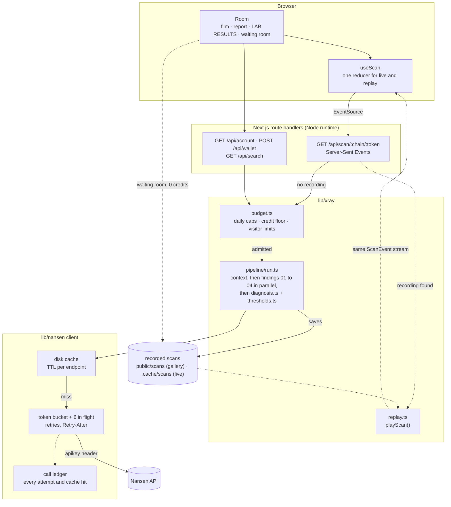

# EXPOSURE

### An x-ray for any token.

**Every chart shows you the price. EXPOSURE shows who's behind it.**

Paste a token and EXPOSURE takes its x-ray in a hospital radiology room: the week's price glows like
bone on a backlit film while the scan beam reveals who really bought, who is selling to whom, where
sellers are waiting and whether smart money is in profit. A typed radiology report gives five
findings and one plain-English diagnosis, and every number on it traces back to a listed Nansen API
call.

<!-- TODO(demo): record docs/demo.gif (see "Recording mode") and uncomment the next line. -->
<!--  -->

**Demo video (60 s):** TODO: link to the X post · **Run it yourself:** three commands, no API key, below.

Built for the **Nansen Meridian Buildathon** (September 2026). Data: [Nansen API](https://www.nansen.ai).
Not financial advice.

---

- [Quick start (no key, 0 credits)](#quick-start-no-key-0-credits)
- [Live x-rays (with a Nansen API key)](#live-x-rays-with-a-nansen-api-key)
- [How it works](#how-it-works): findings · diagnosis · lab flags · architecture · data freshness
- [Nansen API usage](#nansen-api-usage) and [the 1,000+ calls](#how-the-1000-calls-were-made)
- [Data rules and attribution](#data-rules-and-attribution)
- [Scripts](#scripts) · [Deploying](docs/deploy.md) · [Recording mode](#recording-mode) · [Limitations](#limitations-and-honest-caveats) · [Tech stack](#tech-stack) · [License](#credits-and-license)

---

## Quick start (no key, 0 credits)

Requires **Node.js 22.12 or newer** (developed on Node 24). Next.js 16 alone runs on 20.9+, but the
test runner (vitest 5) and the scripts' `--env-file-if-exists` flag need 22.

```bash
git clone https://github.com/0xkuzeydurden/exposure.git && cd exposure
npm i
npm run dev                  # serves http://localhost:3000, no API key needed
open http://localhost:3000   # macOS; anywhere else, open the URL in a browser
```

The home page exposes the featured patient, and the **waiting room** holds 7 real deep scans recorded
from the Nansen API on 26 Sep 2026. Opening one replays its recorded call stream through exactly the
same UI a live scan uses, for **0 credits**; the room labels it "recorded ... UTC · replayed for 0
credits". Nothing in this mode talks to Nansen.

| Patient | Chain | Diagnosis | Confidence | Calls | Open |
|---|---|---|---|---:|---|
| GSTOCK | BNB Chain | Smart money is selling to the crowd. | medium | 172 | `/x/bnb/0xcafdbce93477261db8250e42bdae6e66733f9e20` |
| FP (Fren Pet) | Ethereum | Smart money is quietly buying. | medium | 172 | `/x/ethereum/0xd34a99bc0f67ae1bbd63c660e6d0b0dd03e263b7` |
| NOCK | Base | Sellers are waiting just above the price. | low | 172 | `/x/base/0x9b5e262cf9bb04869ab40b19af91d2dc85761722` |
| STONK | Solana | Smart money is selling to the crowd. | medium | 83 | `/x/solana/6GmAFSYs4gk3FDao5FzzySQpPZaWsa4rUJHacpMpUNgx` |
| 龙虾 | BNB Chain | Sellers are waiting just above the price. | low | 172 | `/x/bnb/0xeccbb861c0dda7efd964010085488b69317e4444` |
| BREW | BNB Chain | Nothing unusual under the surface. | medium | 172 | `/x/bnb/0xfa6d9b504848606eb9aec04ccc161d169b3f2159` |
| ZCAT (Anonymous Cat) | Solana | Smart money is selling to the crowd. | medium | 83 | `/x/solana/HcRLc9VDgjLeK154xDawfb1dmVJ98DoSqcwTHGqiDeJR` |

- `/x/<chain>/<token>` shows a token's recorded x-ray. Without a recording it offers **Take the x-ray**
  with its credit cost. Opening a page never spends credits.
- `public/scans/_synthetic.json` is a generated patient ($KAIRO) marked "SYNTHETIC PREVIEW" on the
  report and in the lab; it is only shown when the gallery is empty.
- `npm test` runs the unit tests with a mocked Nansen API (no network, no key).

## Live x-rays (with a Nansen API key)

```bash
cp .env.example .env.local   # then set NANSEN_API_KEY=... (get one at https://app.nansen.ai/api)
npm run dev                  # restart so the key is read
```

Paste any token (symbol, name or address) at the intake. The intake shows the cost before anything is
spent, and a deep scan asks for a second click that shows the cost and what is left today.

| Tier | What it reads | Credits (upper bound) |
|---|---|---|
| **Quick** | all four findings; the sellers' map comes from the last 30 days of buyers' own buy prices; no funder tracing | **13** on any chain |
| **Deep** | adds first-funder tracing of the top buyers (EVM chains) and each top holder's cost basis from `profiler/address/pnl` | **18 + holders (+ buyers on EVM)**: **48** on EVM and **33** elsewhere with the live defaults of 15 buyers + 15 holders |

Where the credits go (from `lib/xray/budget.ts`, `estimateBreakdown`):

| Part | Quick | Deep |
|---|---:|---:|
| Context: `tgm/token-information` + `tgm/token-ohlcv` + `tgm/dex-trades`, plus one `token-screener` lookup reserved in case token-information comes back empty | 4 | 4 |
| 01 Buyers: `tgm/who-bought-sold` BUY 7d, plus one `first-funder` per traced buyer on EVM | 1 | 1 + buyers |
| 02 Flow: `tgm/flows` × 4 cohorts + `tgm/flow-intelligence` | 5 | 5 |
| 03 Walls: 30-day buyers (quick) · `tgm/holders` (5) + one `pnl` per holder + 30-day buyers at most once (deep) | 1 | 6 + holders |
| 04 Smart money: `tgm/who-bought-sold` BUY + SELL 30d, smart traders | 2 | 2 |
| **Total** | **13** | **18 + holders (+ buyers)** |

Cache hits cost 0, so re-opening a token is free. The live budget guards every spend:

| Variable | Default | Meaning |
|---|---|---|
| `EXPOSURE_LIVE` | on in `next dev`, off in production | `1` turns live scans on for `next start` or a deployment, `0` turns them off everywhere |
| `EXPOSURE_DAILY_CREDITS` | 80 | credits live scans and wallet checks may spend per UTC day |
| `EXPOSURE_DEEP_DAILY_CREDITS` | 50 | the part of the daily cap deep scans may use |
| `EXPOSURE_CREDIT_FLOOR` | 400 | if the balance would drop below this after the scan (and every scan still running), the site goes gallery-only |
| `EXPOSURE_IP_TOKENS` / `EXPOSURE_IP_SCANS` / `EXPOSURE_IP_WALLETS` | 1 / 3 / 3 | per visitor per day (hashed IP), enforced in production or with `EXPOSURE_VISITOR_LIMITS=1` |
| `EXPOSURE_LIVE_MAX_BUYERS` / `EXPOSURE_LIVE_MAX_HOLDERS` | 15 / 15 | fan-out of a visitor's deep scan |
| `EXPOSURE_SCAN_TTL_MIN` | 60 | a recorded live scan younger than this is replayed instead of re-scanned |

- Admission reserves the estimate and settles on what the scan really spent, counted as each call is
  made. A scan cut short keeps its whole reservation. An unknown balance refuses live scans (fails
  closed). The balance comes from the free `GET /account` (cached 5 min) and the
  `X-Nansen-Credits-Remaining` header of the last paid call, whichever is lower.
- One scan runs per token and tier; other tabs attach to it for free.
- Timed-out requests are never retried (they may have been billed) and count at their documented cost.

## How it works

### The five findings

| # | Question | Nansen endpoints (credits) | What is computed |
|---|---|---|---|
| Context | What am I looking at? | `tgm/token-information` (1) · `tgm/token-ohlcv` 1h × 7d (1) · `tgm/dex-trades` BUY by value (1) · `token-screener` by token address, only when token-information lacks symbol, market cap, supply or liquidity (1) | The price film, market cap, liquidity, supply, holders, and the week's biggest buys drawn on the film (without wallets) |
| 01 | How many real buyers? | `tgm/who-bought-sold` BUY 7d (1) · deep, EVM: `profiler/address/first-funder` per top buyer (1 each) | **Independent funding sources** behind the top buyers. Buyers funded by an exchange, bridge or gas relay each count as their own source (thousands of unrelated people withdraw from Binance); the rest are grouped by funder, following chains (A funds B, B funds C: one source). Untraced buyers are left out and reported as a share. Without tracing (quick tier, Solana) it falls back to the top-10 buyers' share of the week's buying. **Demand**: ORGANIC · MIXED · CONCENTRATED |
| 02 | Who is selling to whom? | `tgm/flows` × 4 cohorts (smart money, whale, public figure, exchange), hourly over 7 days (4) · `tgm/flow-intelligence` 7d (1) | **Informed money** (smart money + whales + public figures, aggregated) 7-day net flow as a share of market cap, and whether fresh or unlabelled wallets took the other side. The pulse on the film is that combined balance's cumulative change. **Flow**: ACCUMULATING · QUIET · DISTRIBUTING |
| 03 | Where are sellers waiting? | quick: `tgm/who-bought-sold` BUY 30d (1) · deep: `tgm/holders` (5) + `profiler/address/pnl` per holder (1 each) + 30-day buyers at most once (1) | **Walls**: supply bought above today's price, whose holders get their money back there. A supply-by-entry-price ladder, the underwater share, and allocations (team, vesting, treasury, zero-cost holders) left out and reported separately. When the holders' own cost basis covers under 50% of what they hold, 30-day buyers are blended in at their average price (method "hybrid"). **Ceiling**: LIGHT · HEAVY |
| 04 | Is smart money in profit? | `tgm/who-bought-sold` BUY + SELL 30d, smart-trader labels (2) | **One aggregate** over 30 days: average entry (VWAP) vs price now, and the stance from net ÷ gross flow. Published only for 3+ wallets. **State**: PROFIT · BREAKEVEN · LOSS · **Stance**: ADDING · HOLDING · TRIMMING · EXITING |
| 05 | And you? (on demand) | `profiler/address/pnl` for the pasted wallet (1; up to 3 if the date window has to be narrowed; 0 when the deep scan already read that wallet) | Your average cost vs smart money's entry and vs the supply ladder: EARLY · ON PAR · LATE. The wallet is not stored |

Buyer count: `tgm/who-bought-sold` returns one page of the week's largest buyers (1,000). When the page
is full the count is shown as a floor ("1,000+"), raised to the 24h unique-buyer count from
`tgm/token-information` when that is larger.

### The diagnosis (rules published)

Rules are tried top to bottom and the first match writes the impression (`lib/xray/diagnosis.ts`,
every threshold in `lib/xray/thresholds.ts`, all unit-tested). There is no per-token tuning.

| Rule | Fires when | Impression |
|---|---|---|
| 0 | analysed supply < 25% **and** fewer than 10 top buyers analysed **and** no labelled flow this week | Too few labelled wallets to read this token. |
| 1 | demand is CONCENTRATED | Most of this week's buying traces back to a handful of wallets. |
| 2 | flow is DISTRIBUTING, unless rule 3 applies (a falling price alone does not change the reading) | Smart money is selling to the crowd. |
| 3 | DISTRIBUTING, the price fell, and smart money is at a LOSS or ≥ 60% of the analysed supply is underwater | Holders are giving up. |
| 4 | ceiling is HEAVY | Sellers are waiting just above the price. |
| 5 | flow is ACCUMULATING (and demand is not concentrated) | Smart money is quietly buying. |
| 6 | otherwise | Nothing unusual under the surface. |

The classifications behind it:

| Class | Exact rule |
|---|---|
| **Demand** (01) | ratio = independent sources ÷ traced buyers. **CONCENTRATED** when one non-exchange source did ≥ 35% of the analysed buying, or ratio < 0.35. **ORGANIC** when ratio ≥ 0.6 and the biggest source is < 20%. Otherwise MIXED. Without tracing: top-10 share ≥ 70% is CONCENTRATED, < 50% ORGANIC, else MIXED |
| **Flow** (02) | informed 7-day net flow ÷ market cap (else ÷ circulating supply). ≤ -0.5% **with fresh or unlabelled wallets net buying** is DISTRIBUTING; ≥ +0.5% is ACCUMULATING; otherwise QUIET. Exchange inflow ≥ 0.3% of supply adds the note "moved onto exchanges" |
| **Ceiling** (03) | HEAVY when a wall within +30% of the price is ≥ 1.5× the pool's liquidity or ≥ 8% of the analysed supply, or when ≥ 60% of the analysed supply is underwater. Otherwise LIGHT |
| **Smart money** (04) | PROFIT at ≥ 1.1× the average entry, LOSS below 0.9×, BREAKEVEN between. Stance from (bought - sold) ÷ (bought + sold): ≥ +0.15 ADDING, ≤ -0.15 TRIMMING, ≤ -0.5 EXITING, else HOLDING. Fewer than 3 wallets: only the count is shown |
| **Confidence** | the weakest coverage among the findings the fired rule rests on (the report's footnotes mark them): HIGH ≥ 60%, MEDIUM ≥ 30%, LOW below |

| Finding | Coverage used for confidence |
|---|---|
| 01 Buyers | share of the week's buying analysed × share of analysed buyers traced |
| 02 Flow | 1, or 0.5 when some labelled cohorts returned nothing |
| 03 Walls | share of circulating supply with a known cost basis |
| 04 Smart money | smart-money wallets ÷ 10, capped at 1 |

Three lights sit under the impression: **Flow** (red distributing, green accumulating), **Crowd** (red
concentrated, green organic) and **Ceiling** (red heavy, green light); amber otherwise or when a finding
is unavailable.

### Lab flags

The LAB RESULTS drawer (`lib/xray/lab.ts`) restates each class the way a lab report would. Red is a
warning for someone buying today, amber is borderline, green is within range, grey is no reading.
Flags read the same classification the report uses, so they can never disagree with it.

| Tab | Visual | Reading → flag |
|---|---|---|
| Summary | bedside monitor, one channel per finding | the diagnosis stamp, the three lights and every flag below |
| 01 Buyers | funnel (wallets to sources) + treemap of sources | CONCENTRATED → HIGH (red) · MIXED → BORDERLINE (amber) · ORGANIC → NORMAL (green) |
| 02 Flow | tug of war (informed vs fresh wallets) + daily net bars | DISTRIBUTING → HIGH (red) · QUIET → NORMAL (green) · ACCUMULATING → LOW (green) |
| 03 Walls | price ladder with the pool's liquidity marked | HEAVY → HIGH (red) · LIGHT → NORMAL (green) |
| 04 Smart money | gauge around smart money's entry | PROFIT → HIGH · BREAKEVEN → NORMAL · LOSS → LOW; red when trimming or exiting, amber holding, green adding ("TAKING PROFIT", "BUYING THE DIP", ...). TOO FEW below 3 wallets |
| 05 You | entry-price histogram with yours marked | ≥ 1.1× smart money's entry → LATE (red) · 0.9× to 1.1× → ON PAR · < 0.9× → EARLY (green) |
| Evidence | waffle, one square per call | all calls 2xx → ALL CALLS OK (green) · otherwise "N FAILED" (amber: failed calls count as missing data) |

### Architecture



- **One contract, one code path.** `lib/xray/types.ts` defines `Scan` and the `ScanEvent` stream
  (`stage`, `meta`, `call`, `finding`, `diagnosis`, `done`, `budget`, `error`). A live scan streams it
  over SSE; a recorded scan is replayed as the same events with its recorded call timing, so the film,
  report and lab never know the difference.
- **Solid lines can reach Nansen**, and a paid call only happens after the budget admits the scan or
  wallet check (autocomplete uses the free `search/general`). Dashed lines are the replay path and
  never reach Nansen. A token with a recording younger than `EXPOSURE_SCAN_TTL_MIN`, or a
  gallery file, is replayed instead of re-scanned.
- **The client** (`lib/nansen/client.ts`) reads the disk cache first, then waits for the token bucket
  (`NANSEN_RATE_PER_MIN`, default 280) and a concurrency slot (`NANSEN_CONCURRENCY`, default 6),
  retries 5xx and network errors with backoff, honours `Retry-After` on 429, narrows the date window on
  `query_timeout` / `invalid_date_range`, and appends every attempt and cache hit to the ledger with its
  status, credits (from `X-Nansen-Credits-Used`) and latency. Responses are parsed with lenient zod
  schemas (`lib/nansen/schemas.ts`).

### Data freshness

| Data | Window | Disk-cache lifetime |
|---|---|---|
| Price film, token information | 7 days of hourly candles | 15 min |
| Flows, flow intelligence, DEX trades, token screener | 7 days, hourly buckets (the still-filling bucket is dropped) | 60 min |
| Holders, who-bought-sold, profiler pnl | 7 and 30 days of buyers; cost basis up to 364 days | 24 h (`NANSEN_CACHE_TTL_HOURS`) |
| First funders | a wallet's first gas payment never changes | 30 days |
| Account balance | | 5 min in memory, never on disk |

Every scan carries its `scannedAt` time and window, printed on the report and the lab header. The 7
gallery scans were recorded on 26 Sep 2026 between 10:39 and 10:44 UTC; they are snapshots, not live
data.

## Nansen API usage

Every endpoint EXPOSURE calls, with its documented credit cost (the live `X-Nansen-Credits-*` headers
win when present):

| Endpoint | Credits | Calls per scan | Why |
|---|---:|---|---|
| `tgm/token-information` | 1 | 1 | name, symbol, market cap, liquidity, supply, holders, 24h buyers, deployment date |
| `tgm/token-ohlcv` | 1 | 1 | the 7-day hourly price line on the film |
| `tgm/dex-trades` | 1 | 1 | the week's biggest buys, drawn on the film without wallets |
| `token-screener` | 1 | 0 or 1 | fills symbol / market cap / supply / liquidity for young tokens, by address; also `npm run trending` |
| `tgm/who-bought-sold` | 1 | 3 to 4 | 7-day buyers (01), 30-day buyers (03), smart-trader BUY + SELL over 30 days (04) |
| `profiler/address/first-funder` | 1 | 1 per traced buyer (deep, EVM) | who paid each top buyer's first gas (01) |
| `tgm/flows` | 1 | 4 | hourly balances of smart money, whales, public figures and exchanges (02) |
| `tgm/flow-intelligence` | 1 | 1 | Nansen's own 7-day net-flow headline and fresh-wallet flow (02) |
| `tgm/holders` | 5 | 1 (deep) | the holder list to price (03) |
| `profiler/address/pnl` | 1 | 1 per holder (deep) | each holder's cost basis (03) and the pasted wallet (05) |
| `search/general` | 0 | 0 | intake autocomplete by name or symbol; an address is never sent |
| `account` | 0 | 0 | balance for the credit floor, cached 5 min |

### How the 1,000+ calls were made

Every paid call came from the project's own scripts, each of which prints its estimate and asks before
spending: `npm run trending` to find candidate tokens (5 calls), `npm run smoke` for a GO/NO-GO data
test on one token (52 calls), then `npm run warm` to record the 7 gallery patients as deep scans with 90
buyers and 70 holders each (1,012 calls: 172 per EVM token, 83 per Solana token, minus 14 funders
already cached). `npm run ledger` summarises the local call ledger (it only reads
`.ledger/calls.ndjson`; no network):

| Endpoint | Network calls (2xx) | Errors / retries | Cache hits | Credits |
|---|---:|---:|---:|---:|
| `profiler/address/pnl` | 510 | 0 | 0 | 510 |
| `profiler/address/first-funder` | 456 | 0 | 14 | 456 |
| `tgm/flows` | 32 | 4 | 0 | 32 |
| `tgm/who-bought-sold` | 26 | 0 | 0 | 26 |
| `account` | 8 | 1 | 0 | 0 |
| `tgm/dex-trades` | 8 | 0 | 1 | 8 |
| `tgm/flow-intelligence` | 8 | 0 | 0 | 8 |
| `tgm/holders` | 8 | 0 | 0 | 40 |
| `tgm/token-information` | 8 | 0 | 1 | 8 |
| `tgm/token-ohlcv` | 8 | 0 | 1 | 8 |
| `token-screener` | 5 | 0 | 0 | 5 |
| **Total** | **1,077** | **5** | **17** | **1,101** |

**1,069 successful paid Nansen API calls** (excluding the free `account`), 25 Sep 19:36 to 26 Sep
10:43 UTC. The ledger itself stays local, but the evidence ships with the repo: each gallery file in
`public/scans/` lists every call it made (endpoint, status, credits, latency, cache), 1,026 call
records in total, and the Evidence tab of the lab shows them. See [docs/api-usage.md](docs/api-usage.md)
for the per-scan breakdown and a one-line check.

## Data rules and attribution

Following Nansen's redistribution rules:

- **Shown per wallet:** this week's top buyer wallets (`tgm/who-bought-sold`) and the wallet that
  funded each one (`profiler/address/first-funder`), shortened (`0x12ab…9f3c`) with a copy button and an
  **Open in Nansen ↗** link to its profiler page. A funder goes by its Nansen entity name when it has one
  ("Binance"), else by its short address.
- **Aggregate only:** smart money. EXPOSURE never marks a wallet as smart money: no smart-money list,
  per-wallet number or label. A buyer's label is never kept, and a funder name that is a smart-money or
  behavioural label ("Smart Trader", "Fund", "Whale", ...) is dropped (`lib/xray/redact.ts`). Finding 04
  is one aggregate over 30 days of at least 3 wallets (below that only the count), and the flow pulse
  and bars are published only when they mix at least two informed cohorts.
- **Never shown:** wallets behind the big buys on the film, holder wallets behind the walls, and the
  wallet you paste (it is not stored).
- **Attribution:** "Powered by Nansen API" is on every screen, every address links to its Nansen
  profile, and the Evidence tab lists every call with its status, credits, latency and cache state.

## Scripts

| Command | What it does | Credits |
|---|---|---|
| `npm run dev` | development server on :3000 (`npm run demo` is the same) | 0 until you take a live x-ray |
| `npm run build` / `npm start` | production build and server; live scans stay off unless `EXPOSURE_LIVE=1` | 0 |
| `npm test` | unit tests (vitest), Nansen mocked | 0 |
| `npm run lint` / `npm run typecheck` | eslint / `tsc --noEmit` | 0 |
| `npm run fixture` | rebuilds the synthetic patient `public/scans/_synthetic.json` | 0, offline |
| `npm run rediagnose [-- --check]` | re-reads every recorded scan in `public/scans/` with the current rules and thresholds (`--check` only prints what would change) | 0, offline |
| `npm run ledger [-- --since=2026-09-25]` | summarises `.ledger/calls.ndjson` as a markdown table | 0, reads a local file |
| `npm run trending [-- --sort=volume\|buyers] [--per-chain]` | gallery candidates from the token screener | 1 per call (one call by default) |
| `npm run shortlist [-- --chains=base,solana] [--holders]` | candidates per chain | 1 per chain (+1 per token with `--holders`) |
| `npm run smoke -- base:0xTOKEN [--buyers=20] [--holders=20]` | GO/NO-GO data test: a small deep scan that prints tracing, flow and cost-basis coverage; asks first | about 58 on EVM, 38 on Solana at 20/20; refuses above 70 without `--force` |
| `npm run warm -- bnb:0xTOKEN sol:MINT ... [--buyers=60] [--holders=40]` | records gallery scans into `public/scans/`; asks first unless `--yes` | up to 118 per EVM token and 58 elsewhere at the defaults; 0 for responses already cached (`--refresh` refetches) |

`smoke`, `trending`, `warm` and `shortlist` read `NANSEN_API_KEY` from `.env.local`. `warm --hints=cache`
fills missing symbols and market caps from token-screener rows already on disk instead of spending a
lookup.

## Recording mode

The demo video is played by the app itself. `?rec=1` turns the room into a 60-second scripted cut that
needs no mouse and uses only recorded gallery scans (0 credits, no key): a title card, the exposure of
patient A, one caption per finding while the report types, LAB RESULTS (Summary, 01, 03, Evidence),
then a patient B with a different diagnosis at double tempo, and an end card with the repository link.

| Parameter | Effect |
|---|---|
| `?rec=1` | recording mode (`?director=1` also works). Patient A is the page's patient: the featured scan on `/`, that token on `/x/<chain>/<token>` |
| `?autostart=1` | skips the "Click to start" plate. Sound stays muted, because browsers only allow audio after a click |
| `?speed=2` | plays the whole script and the room's own animations twice as fast (a 30-second check); clamped to 0.25 to 8, default 1 |

```bash
# the end card shows github.com/0xkuzeydurden/exposure (override with NEXT_PUBLIC_REPO_URL); record at 1920×1080:
http://localhost:3000/?rec=1
http://localhost:3000/x/bnb/0xcafdbce93477261db8250e42bdae6e66733f9e20?rec=1&autostart=1&speed=2
```

Separately, the SSE route takes `speed` (1 to 60, default 6) when it replays a recorded scan.

## Limitations and honest caveats

- **A first funder is the wallet that paid a buyer's first gas**, not necessarily the source of its
  money. An unlisted funding or relay service looks like one wallet funding many buyers and can make
  demand read more concentrated than it is; `npm run smoke` prints the biggest hub with its Nansen
  label so it can be checked.
- **Funder tracing is EVM only** (`first-funder` has no Solana support). On Solana, and on the quick
  tier, finding 01 falls back to how concentrated the week's buying is, and the report says so.
- **Cost basis covers the analysed holders only.** Coverage is printed on every finding and sets the
  confidence; in the gallery it ranges from 5% of circulating supply (龙虾) to 70% (ZCAT).
- **The pnl window is one year** (364 days, or since deployment when younger). Holdings bought earlier
  have no cost basis in that window.
- **Allocations are recognised by heuristics** (more than the circulating supply, a team / vesting /
  treasury / lock label, or zero cost basis and zero buys over the token's whole history). A holder
  that received tokens off-DEX (an airdrop, an exchange withdrawal) reads as an allocation unless it
  also bought in the last 30 days.
- **The buyer list is one page** of the week's 1,000 largest buyers, so counts above that are floors.
- **Smart money is Nansen's label**, aggregated over 30 days; a cohort's balance also moves when wallets
  join or leave it, which is why the flow headline uses `tgm/flow-intelligence`.
- **Thresholds are fixed heuristics**, published above and not tuned per token. A diagnosis is a
  reading of on-chain positioning, not a prediction and not financial advice.
- **Budget and rate-limit state live in one server process** (the budget is persisted to
  `.cache/budget.json`, the rate limiter is in memory). A multi-instance deployment would need shared
  storage for both.

## Tech stack

- **Next.js 16.3** (App Router, Node route handlers, Server-Sent Events) · **React 19.2** · **TypeScript 5**
- **Tailwind CSS 4** · **GSAP 3** for the exposure sequence · the film is hand-built **SVG** · **Web Audio**
  for the typewriter, bell and monitor beep · fonts via `next/font` (IBM Plex Sans Condensed, Courier
  Prime, JetBrains Mono)
- **zod 4** schemas for every Nansen response · **p-limit** + a token bucket for the rate limit
- **vitest 5** unit tests · **tsx** scripts

```
app/                 pages (/, /x/[chain]/[token]) and route handlers (app/api/*)
components/exposure/ the room: Film, Report, LabResults (+ lab/*), WaitingRoom, Intake, Signage, Director
hooks/               useScan (live + replay reducer), useTypewriter, useDirector (recording mode)
lib/xray/            contract (types.ts), pipeline/, diagnosis, thresholds, lab, budget, replay, redact
lib/nansen/          API client, endpoints and costs, cache, rate limit, ledger, zod schemas
public/scans/        the 7 recorded gallery scans, index.json and the synthetic patient
scripts/             trending, shortlist, smoke, warm, fixture, ledger
tests/               unit tests (Nansen mocked)
```

## Credits and license

- Data: [Nansen API](https://www.nansen.ai). Powered by Nansen API.
- Fonts: IBM Plex Sans Condensed, Courier Prime and JetBrains Mono (SIL Open Font License), via Google
  Fonts.
- Code: [MIT](LICENSE) © 2026 EXPOSURE contributors.
